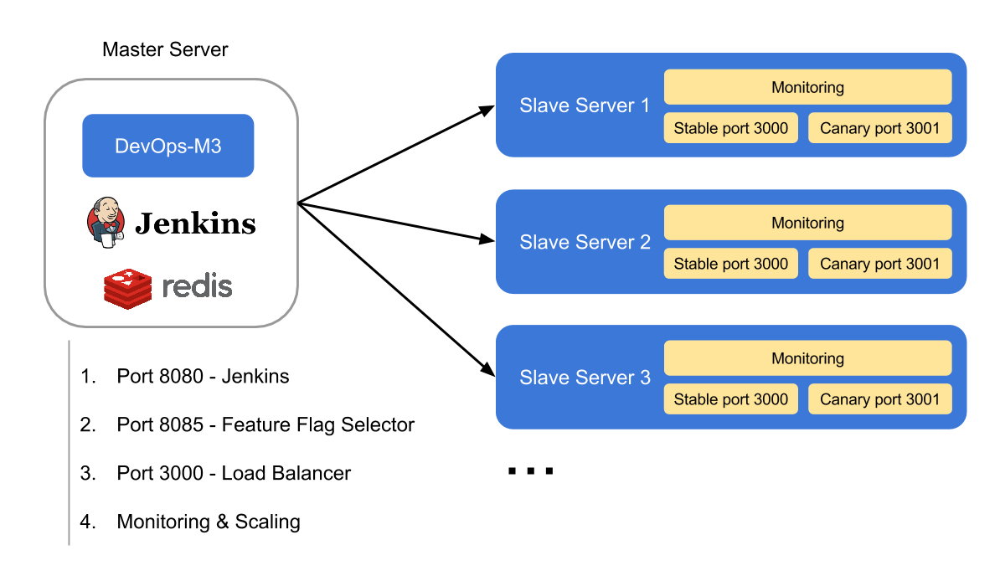
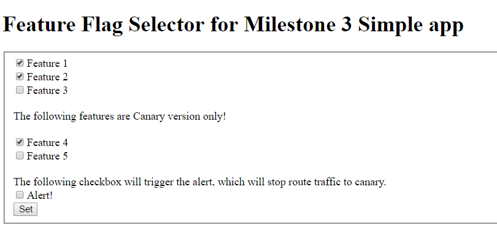
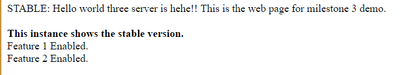

# DevOps-M3
This is the repository for [DevOps Milestone 3](https://github.com/CSC-DevOps/Course/blob/master/Project/M3.md). We use [M3-simpleApp](https://github.ncsu.edu/DevOps-Milestones/M3-simpleApp) as our simple node.js application.
 -  Simple node.js application: [link](https://github.ncsu.edu/DevOps-Milestones/M3-simpleApp)
 -  Screencast: [link](https://youtu.be/9Ea8s8RQEvM)

### Prerequisite
##### Milestone 3 server structure.


##### Milestone 3 file structure. 
```
.
├── ec2_manager
│   ├── ec2_creator.sh
│   ├── createAWS.js
│   ├── deploy
│   │   ├── deploy.retry
│   │   ├── deploy.yml
│   │   └── roles
│   ├── inventory
│   ├── deploy_all_slavers.sh
│   ├── updateRedisIps.js
│   ├── slavers
│   └── package.json
├── flag_selector
│   ├── form.html
│   ├── package.json
│   └── selector.js
├── load_balancer
│   ├── balancer.js
│   └── package.json
├── main_server_deployer
│   ├── deploy_mainserver.yml
│   └── inventory
└── monitoring
    ├── scaling.js
    └── package.json
```
 - Folder `ec2_manager` is used to build a new AWS EC2 instance and config the production environment automatically.
  - File `ec2_creator.sh` is a shell file. Basically, you can run `bash ec2_creator.sh`. And then a new AWS EC2 instance with production environment and our simple node.js application will be built.
  - File `createAWS.js` is the main script to build the AWS EC2 instance.
  - Folder `deploy` stores a configuration files used for ansible. These configuration files will install node.js, npm, git clone the simple node.js application and start the express server using forever.
  - File `inventory` stores the information of newly-added AWS EC2 instance. It is used to automatically configure one production environment.
  - File `deploy_all_slavers.sh` is used to upsate all AWS EC2 instances.
  - File `updateRedisIps.js` is called by `deploy_all_slavers.sh`. It will add a new ip address to Redis.
  - File `slavers` stores the information of all created AWS EC2 instances. It is used to automatically configure all production environments when Jenkins build is pass.
  - File `package.json` is a configure file for node.js.

  
 - Folder `flag_selector` store the scripts and view pages of feature flag selection.
  - File `form.html` is a view page for feature flag selection and alert.
  - File `selector.js` is a script for obtaining the feature flag(s) and alert from view page and store the information to a global redis store. And scripts ([stable_inst.js](https://github.ncsu.edu/DevOps-Milestones/M3-simpleApp/blob/master/stable_inst.js) and [canary.js](https://github.ncsu.edu/DevOps-Milestones/M3-simpleApp/blob/master/canary.js)) in our simple node.js application will read certain key stored in redis and display certain turn-on features.
  - File `package.json` is a configure file for node.js.

 - Folder `load_balancer` is used to perform a canary release - route a percantage of traffix to a newly staged version of application and remaining traffix to stable version of application.
  - File `balancer.js` reads the ip address of AWS EC2 instances (slaves) stored in redis and used http-proxy to loab balance. By default, 70% of traffic will go to stable version of application and 30% of traffic will go to newly staged version of application.
  - File `package.json` is a configure file for node.js.
 
 - Folder `main_server_deployer` stores ansible configurations of main server.
  - File `deploy_mainserver.yml` will install redis to main server, git clone this repo and start the feature flag service (port 8080), load balancer service (port 3000) and monitoring service (port 8100).
  - File `inventory` records the ip address and private key used for ansible configuration.
 
 - Folder `monitoring` is used to perform autoscale if necessary.
  - File `scaling.js` is the script for analyse the monitoring metrics from deployed AWS EC2 instances and autoscale individual components of production if necesssary.
  - File `package.json` is a configure file for node.js.


##### Redis Data Structure
  - Proxy - we use set data structure to store the ip addresses of slaver servers. Set in Redis supports random pop up. Hence it is easy for us to do load balance.
  - Alert - we use 0 to represent alert is off and use 1 to represent alert if on.
  - IP address - we also use each ip address as key to store the timestamp, CPU usage and memory usage of certain slave server. We will keep 20 records. And since the dafault delay of `os-monitor` is 3 seconds, we actually store one minute's monitoring information of each slave server. 

### TASK1: `Deploy after build, testing and analysis stage.`
**Requirement:** The ability to deploy software to the production environment triggered after build, testing, and analysis stage is completed. The deployment needs to occur on actual remote machine/VM (e.g. AWS, droplet, VCL), and not a local VM.

At beginning, the developer changes the source code (simple node.js application in this case), commits and pushes the modifications to GitHub.Then Then GitHub webhook will trigger Jenkins and start a new job. Each new job will run [test suite](https://github.ncsu.edu/DevOps-Milestones/M3-simpleApp/blob/master/test/test.js). The output of test suite is shown below.
```
+ bash test.sh
info:    Forever processing file: stable_inst.js

> queue@0.0.0 test /var/lib/jenkins/workspace/M3-simpleapp
> ./node_modules/.bin/istanbul cover ./node_modules/.bin/mocha ./test/test.js
  server
    ✓ should return 200

  1 passing (17ms)
```

If all test cases are passed, the post build task of Jenkins will use ansible to deploy the latest version of application to all AWS EC2 instances. Sample output is shown below.
```
PLAY [aws_server] **************************************************************

TASK [setup] *******************************************************************
ok: [node2]
ok: [node0]
ok: [node1]

TASK [common : update apt packages] ********************************************
ok: [node0]
ok: [node2]
ok: [node1]

TASK [common : install basic apt packages] *************************************
ok: [node2] => (item=[u'curl', u'git'])
ok: [node1] => (item=[u'curl', u'git'])
ok: [node0] => (item=[u'curl', u'git'])

TASK [nodejs : update apt packages] ********************************************
ok: [node2]
ok: [node1]
ok: [node0]

TASK [nodejs : install nodejs requirements] ************************************
ok: [node2] => (item=[u'python-software-properties', u'python', u'g++', u'make'])
ok: [node0] => (item=[u'python-software-properties', u'python', u'g++', u'make'])
ok: [node1] => (item=[u'python-software-properties', u'python', u'g++', u'make'])

TASK [nodejs : add Chris Lea's nodejs ppa] *************************************
ok: [node1]
ok: [node2]
ok: [node0]

TASK [nodejs : install nodejs] *************************************************
changed: [node1]
changed: [node2]
changed: [node0]

TASK [Install forever] *********************************************************
changed: [node2]
changed: [node1]
changed: [node0]

TASK [make sure all port stopped] **********************************************
changed: [node2]
changed: [node1]
changed: [node0]

TASK [Creates .ssh directory for root] *****************************************
ok: [node1]
ok: [node2]
ok: [node0]

TASK [Upload the private key used for Github cloning] **************************
ok: [node2]
ok: [node0]
ok: [node1]

TASK [Correct SSH deploy key permissions] **************************************
ok: [node1]
ok: [node2]
ok: [node0]

TASK [Deploy site files from Github repository] ********************************
changed: [node2]
changed: [node1]
changed: [node0]

TASK [install packages for M3-simpleApp] ***************************************
changed: [node0]
changed: [node1]
changed: [node2]

TASK [start stable server at 3000] *********************************************
changed: [node2]
changed: [node1]
changed: [node0]

TASK [start canary server at 3001] *********************************************
changed: [node2]
changed: [node1]
changed: [node0]

PLAY RECAP *********************************************************************
node0                      : ok=16   changed=7    unreachable=0    failed=0   
node1                      : ok=16   changed=7    unreachable=0    failed=0   
node2                      : ok=16   changed=7    unreachable=0    failed=0   
```

### TASK2: `Configure a production environment automatically.`
**Requirement:** The ability to configure a production environment automatically, including all infrastructure components, such web server, app service, load balancers, and redis stores. Configure should be accopmlished by using a configuration management tool, such as ansible, or docker. Alternatively, a cluster management approach could also work (e.g., kubernates).

We use ansible to meet with this requirement. 

 - **Main server automatic deployment**: 
The [deploy_mainserver.yml](https://github.ncsu.edu/DevOps-Milestones/DevOps-M3/blob/master/main_server_deployer/deploy_mainserver.yml) under /main_server_deployer/ folder is used to configure the production environment of master server, which will do following tasks each time:
  - Install node.js, npm
  - Install and start Redis service
  - Insert initial keys and values into Radis
  - Git clone the simple node.js application source code
  - Use forever to start the `Feature Flag Selector`, `Load Balancer` and `Monitoring & Scaling`.

 - **AWS EC2 instance automatic deployment**: 
The [deploy.yml](https://github.ncsu.edu/DevOps-Milestones/DevOps-M3/blob/master/ec2_creator/deploy/deploy.yml) under /ec2_creator/deploy/ folder is focus on configuring the production environment of slave server, which will do following tasks each time:
  - Install node.js, npm
  - Git clone the simple node.js application source code 
  - Use forever to start the stable app on port 3000 and the canary app on port 3001.

### TASK3: `Monitor the deployed application.`
**Requirement:** The ability to monitor the deployed application (using at least 2 metrics) and send alerts using email or SMS (e.g., smtp, mandrill, twilio). An alert can be sent based on some predefined rule.

We wrote a [monitoring.js](https://github.ncsu.edu/DevOps-Milestones/M3-simpleApp/blob/master/monitoring.js) file to check the `CPU usage` and `memory usage` of each AWS EC2 instance each 3 seconds by default. Then we stored the latest 20 records into Redis store using each ip address as the key.

In [scaling.js](https://github.ncsu.edu/DevOps-Milestones/DevOps-M3/blob/master/monitoring/scaling.js) file, we will check the average CPU and memory usage of each AWS EC2 instances by using [os-monitor](https://www.npmjs.com/package/os-monitor). If both the average CPU usage and average memory usage is higher than 70%, an email will be send by using [Nodemailer 2.x](https://nodemailer.com/).

### TASK4: `Autoscale individual components of production.`
**Requirement:** The ability to autoscale individual components of production and maintain and track in a central discovery service. Autoscale can be triggered by a predefined rule.

We uses the same rule as mentioned above (both the average CPU usage and average memory usage is higher than 70%). If this rule is reached, the main server will not only send the email mentioned in TASK4, but also create a new AWS EC2 instance and set up the environment, deploy the code and start the server automatically as mentioned in TASK2. Once a new AWS EC2 instance is built, the main server will start monitoring it automatically and start analyse the CPU usage and memory usage.

### TASK5: `Set up the feature flags.`
**Requirement:** The ability to use feature flags, serviced by a global redis store, to toggle functionality of a deployed feature in production.

We created a GUI to do feature flag selection, which will be more straightforward. The screenshot of the GUI is shown below.


In order to distinguish the stable version of application and canary version of application, we defined that the stable version can access to feature 1 to 3 and canary version can access not only feature 1 to 3, but also new feature 4 and 5. Also we added an alert checkbox (for TASK 6) to manually trigger the alert instead of using stress testing to reach our predefined rule mentioned in TASK4 and TASK5.

When certain feature is turned on, different page will show different message. The screenshots below display that stable version of application turned on feature 1 and 2 and the canary version of application turned on feature 1, 2, 4.



### TASK6: `Perform a canary release.`
**Requirement:** The ability to perform a canary release: Using a proxy/load balancer server, route a percentage of traffic to a newly staged version of software and remaining traffic to a stable version of software. Stop routing traffic to canary if alert is raised.

We create a load balancer by using [http-proxy](https://www.npmjs.com/package/http-proxy). Since we stored all ips of AWS EC2 instances into  Redis, the proxy server will send each request to a random AWS EC2 instance. And for each instance, 70% of the posibilities will trigger the stable version of application and 30% if the possibilities will trigger the canary version of application. We can also manually turn on the alert as mentioned in TASK5. After we turn on the alert, the proxy server will still send each request to a random AWS EC2 instance, however, 100% of the possibilities will trigger the stable verion of application.
